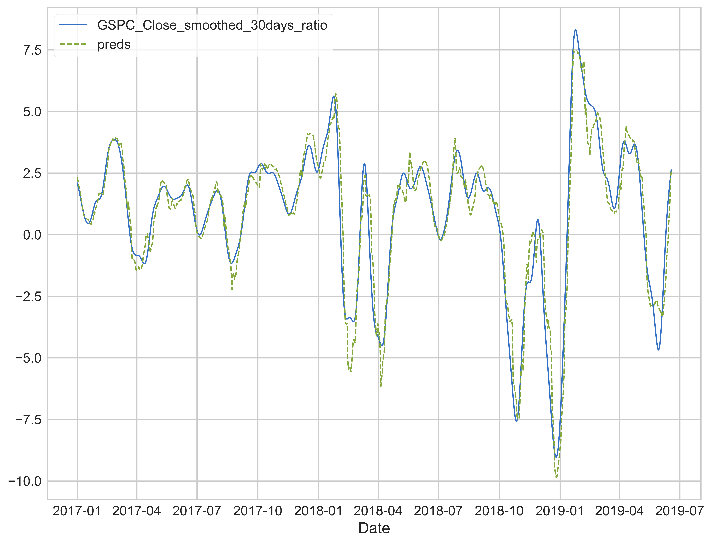
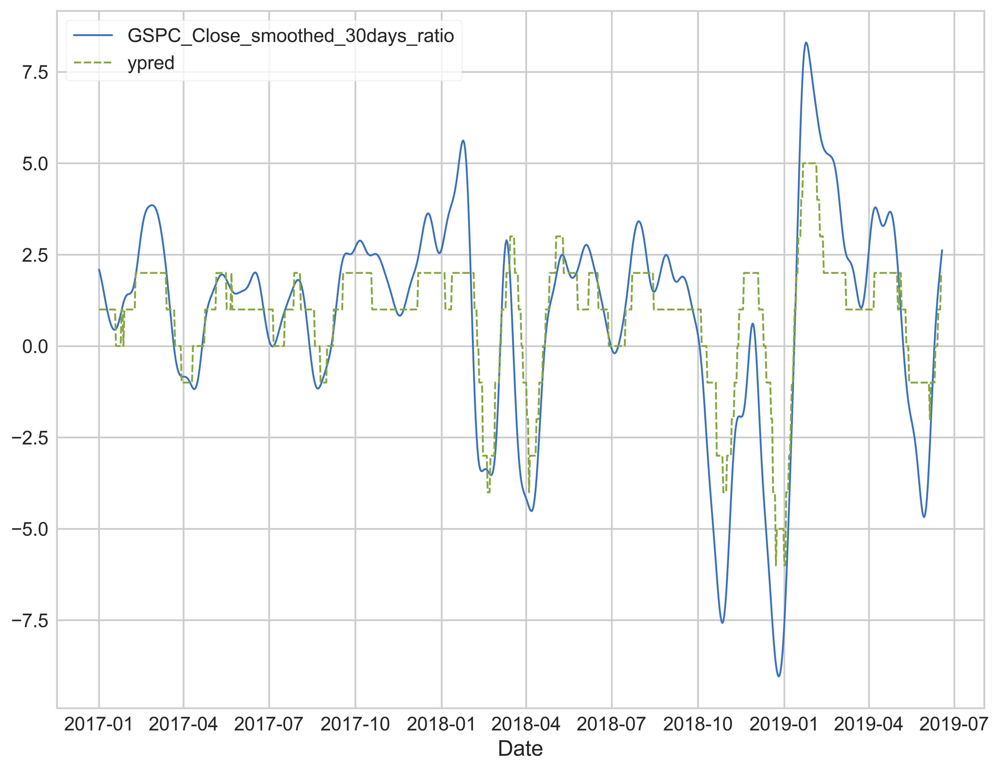
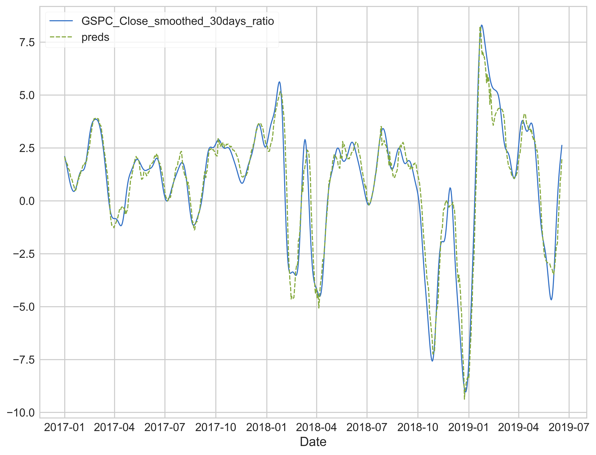
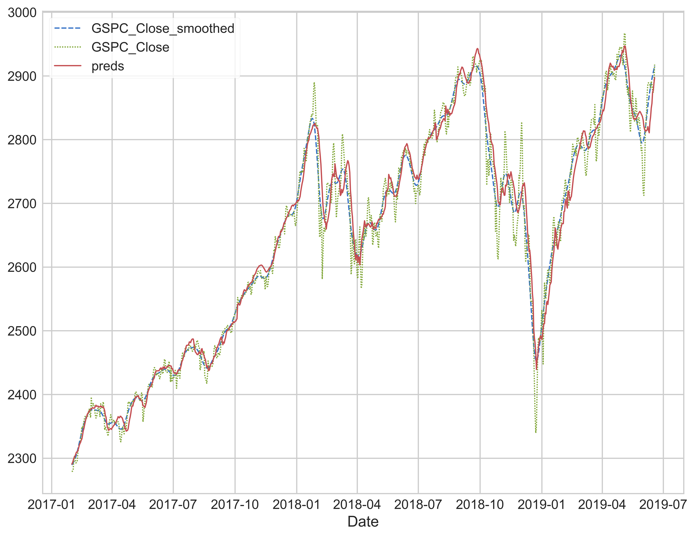
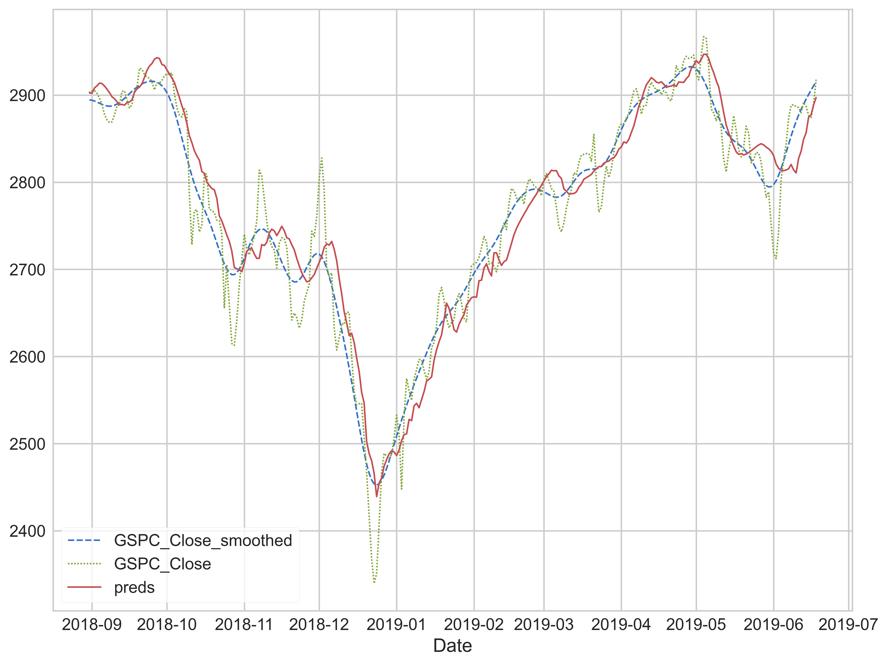
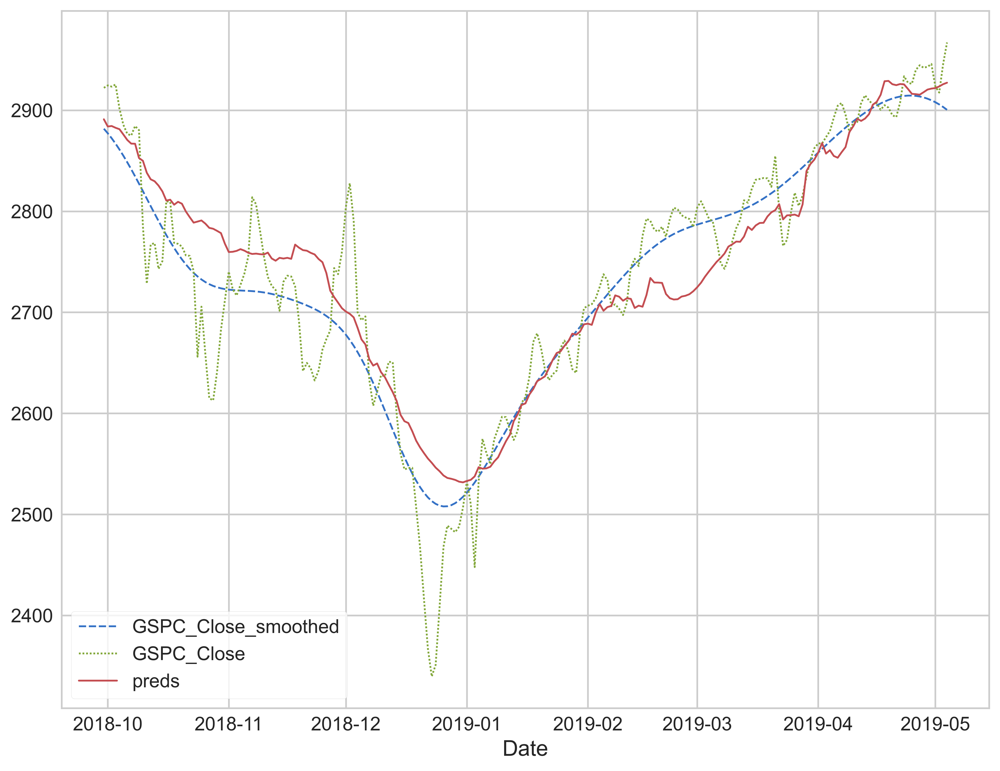
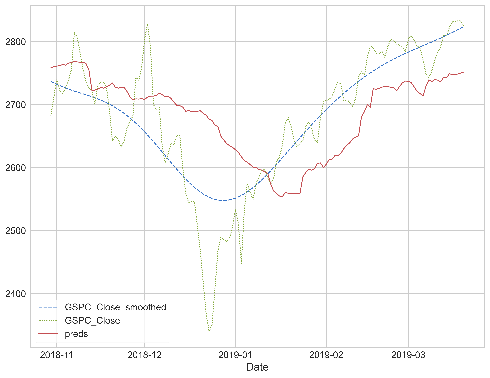
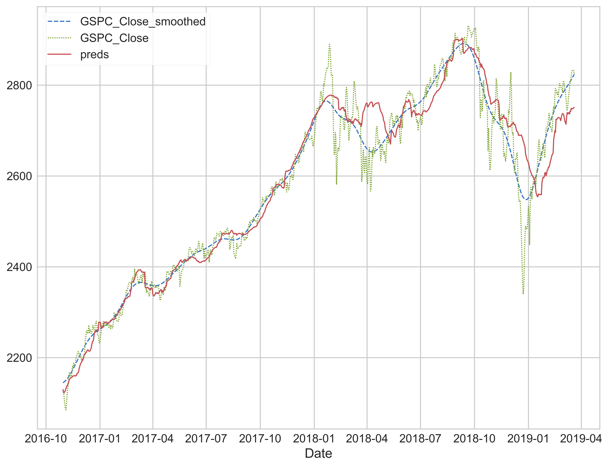

# IndexAI
Using machine learning to predict the SP500 index

---
## Intro
As a learning project, I decided to predict the SP500 index using random forest, LightGBM, and XGBoost. This project originally started in late 2019 but I had no idea how to actually get the machine learning part done until I took the Kaggle lessons (hence the 3 models used). As I am now taking Intelligent Systems Engineering (mostly about neural networks) at school, hopefully, I can test out more models.

## Method

To properly train/predict the index, we cannot use the raw values as it increases over time. The raw values even just a few years ago are completely useless to train the models since all the models tested here are decision trees. They don’t perform any mathematical calculations on the data. To solve this, instead of using the raw values, I used the ratio of the value we want to predict and the most recent value we have access to. To put it more plainly:

For example, if we are predicting the index 30 days away:

This moving normalization/ ratio formula was chosen so the data would remain in the same ballpark for all the values. In a distanced sense, this is like a derivative, as both are describing the rate of change. Noting the ratio has the index of i+predict_distance, otherwise, we will have a leak.

Besides the normalization, trendlines are also very important for improving the prediction. For the current implementation, only the first and second order polynomial extrapolations are used since the linear (first order) extrapolation provides most of the benefit.

## Results

Random forest, 30 days ratio prediction:

  

  
MAE: 0.550

LightGBM, 30 days ratio prediction:

  
  
MAE score: 1.238

XGBoost, 30 days ratio prediction:

MAE score: 0.493

As we can see, XGBoost performs the best in this bunch. If we would to compare it to the actual index:

It predicted the SP500 pretty well. We can also zoom in a bit closer:

  

Some of the local extrema are shifted, which is expected. Since the grid is one month wide, we can see that the delay is only a few days. However, of course, that will increase if we increase the prediction distance, for example, 60 days:

 

The prediction does lag a bit more. The MAE is 0.601 for the ratio prediction. Noting the smoothed SP500 dataset is obtained by passing the original data through a Blackman filter with a window size equal to the prediction distance, so the MAE values are not directly comparable. To test the limit of the model, let's try a prediction distance of 90 days:

 

 The MAE is still around 0.899, which means the ratio only deviated 0.899% from the smoothed dataset, on average. It did predict the 2018 year end stock crash, even though its with a 1 month delay. With a prediction distance of 90 days, 30 days delay is not too unexpected. However, if we zoom out a bit more:

   

   We can see this model is significantly less reliable at 90 days than at 30 days

## TODO

- ~~Try more models (i.e. SVM, MLP, CNN)~~ See the [DNN branch](../../tree/DNN) for neural network models
- export the trained model and wrap the code so it can send the prediction periodically (i.e. monthly/ bi-weekly) through email

## License
My work is released under the MIT license
