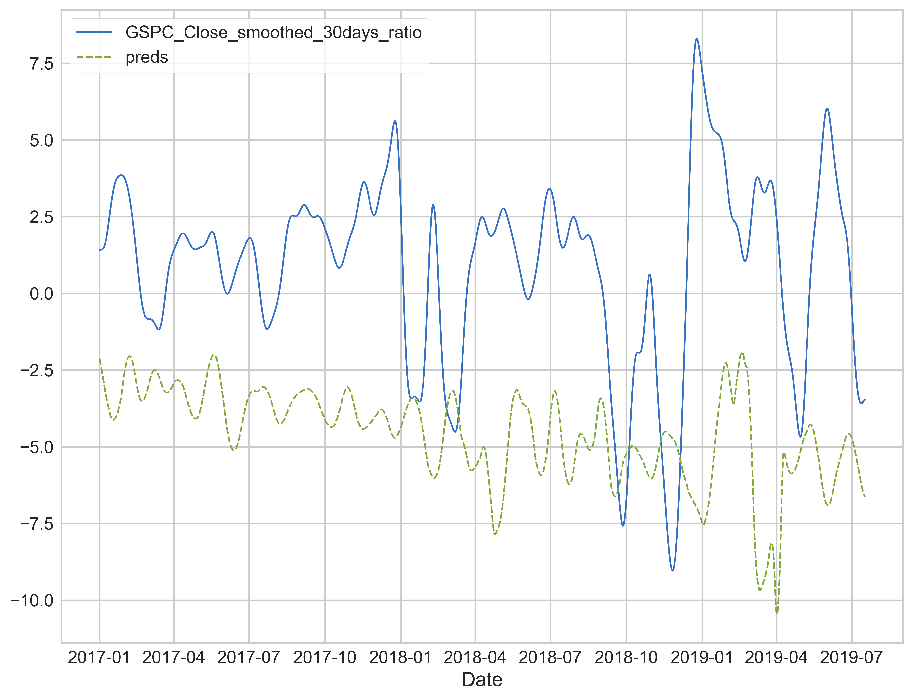
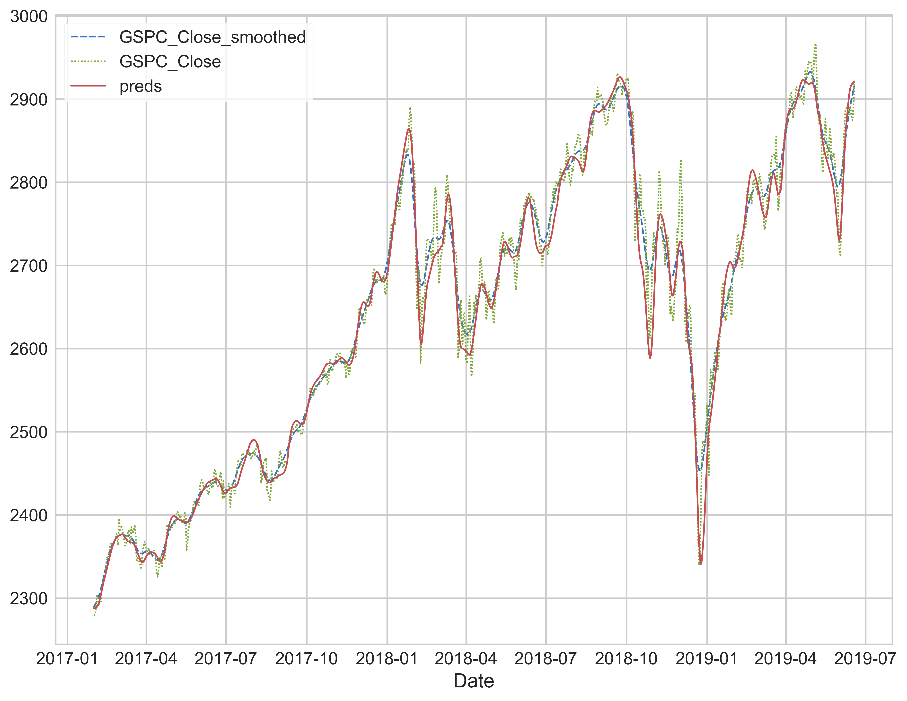
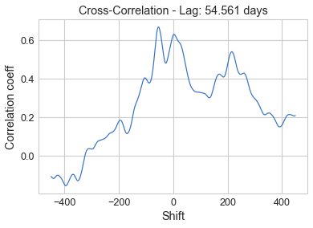

# IndexAI-DNN
Using Deep Neural Networks to predict the SP500 index

---
## Intro
Here I tried MLP using scikit-learn, MLP, LSTM, CNN using TensorFlow/Keras

## Method

To properly train/predict the index, we cannot use the raw values as it increases over time. The raw values even just a few years ago are completely useless to train the models since all the models tested here are decision trees. They don’t perform any mathematical calculations on the data. To solve this, instead of using the raw values, I used the ratio of the value we want to predict and the most recent value we have access to. To put it more plainly:

For example, if we are predicting the index 30 days away:

This moving normalization/ ratio formula was chosen so the data would remain in the same ballpark for all the values. In a distanced sense, this is like a derivative, as both are describing the rate of change. Noting the ratio has the index of i+predict_distance, otherwise, we will have a leak.

Besides the normalization, trendlines are also very important for improving the prediction. For the current implementation, only the first and second order polynomial extrapolations are used since the linear (first order) extrapolation provides most of the benefit.

## Results
CNN, 30 days ratio prediction:

MAE score: 0.437

As we can see, CNN performs the best in this bunch. If we would to compare it to the actual index:

It predicted the SP500 pretty well. The cross-correlation shows promising results:

  

Lets try the prediction distance of 90 days:

## License
My work is released under the MIT license
