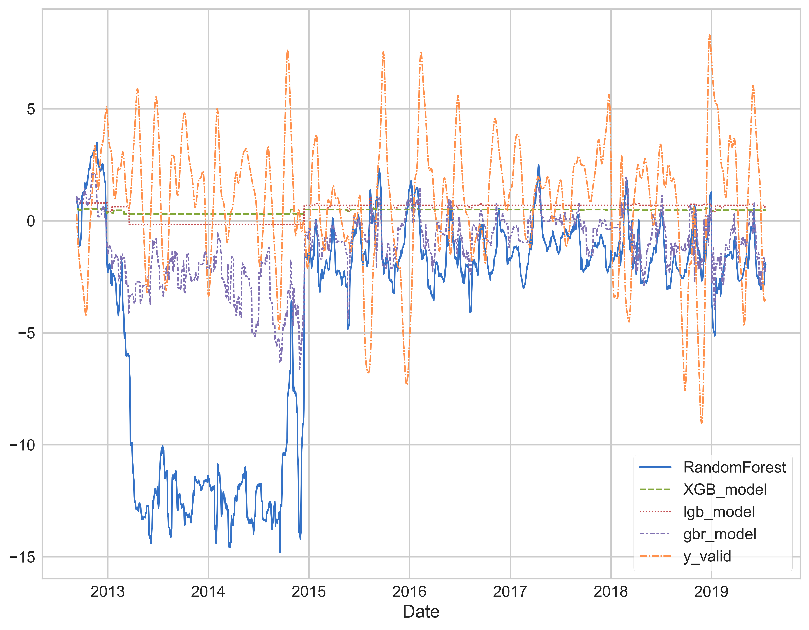
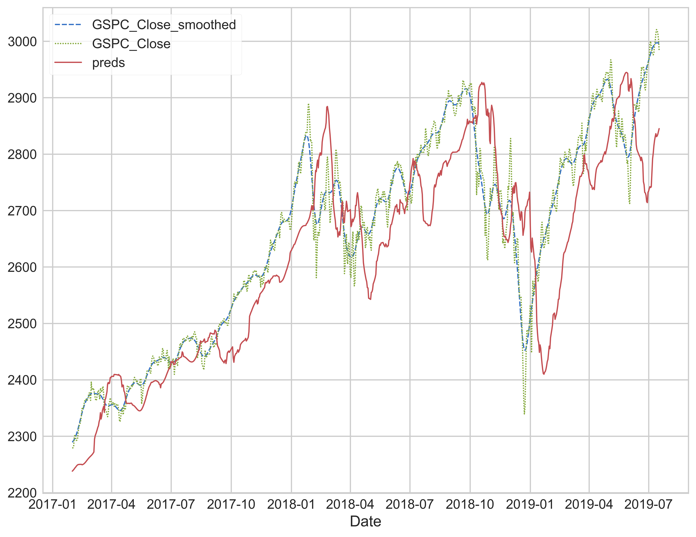
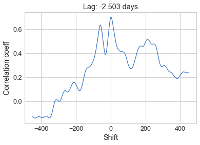

# IndexAI
Using machine learning to predict the SP500 index

---
## Intro
As a learning project, I decided to (try to) predict the SP500 index using random forest, LightGBM, and XGBoost, and also combine the results with another layer of a mechine learning model. The concept of this project first formed in late 2019 but I had no idea how to get the machine learning part done until I took the Kaggle lessons in the summer of 2020 (hence the 3 models used). Since I took Intelligent Systems Engineering at school during the fall, I was able to learn and try some deep learning models as well.

## Method

To properly train/predict the index, we cannot use the raw values as it increases over time. The raw values even just a few years ago are completely useless to train the models since all the models tested here are decision trees. They don’t perform any mathematical calculations on the data. To solve this, instead of using the raw values, I used the ratio of the value we want to predict and the most recent value we have access to. To put it more plainly:

For example, if we are predicting the index 30 days away:

This moving normalization/ ratio formula was chosen so the data would remain in the same ballpark for all the values. In a distanced sense, this is like a derivative, as both are describing the rate of change. Noting the ratio has the index of i+predict_distance, otherwise, we will have a leak.

## Results
The results, as expected, are horrible. If it is this easy to predict the market, then someone would be already doing it. The results obtained originally were too good to be true, so I went through the code to refactor and double-check the validity of the data processing method, and found errors in some indexing (most significantly in extrapolating the current value) that leaked the future results into the current time data. After fixing the leak, the prediction results of the ratio have shown very little correlation with the actual values:

With most of the predictions being constant values close to zero, means the reconstructed S&P 500 would be simply autocorrelated to itself (i.e. it's just a time-delayed version), as shown here for the combined GBR model.

Autocorrelated result doesn’t really hold much useful information, and if we take a look at the cross-correlation plot:

We can see a significant peak at -30days, which is the prediction distance.

## Conclusion
Even though this project did not successfully predict the market (as expected since the get-go), I still learnt important lessons from the experience, such as the importance of preventing data leakage (and how to verify them), the general process of applying machine learning on time series data sets (data processing with pandas and NumPy), and how to properly evaluate the performance of the model (such as the use of cross-correlation analysis).

## TODO

- ~~Try more models (i.e. SVM, MLP, CNN)~~ See the [DNN branch](../../tree/DNN) for neural network models
- ~~ export the trained model and wrap the code so it can send the prediction periodically (i.e. monthly/ bi-weekly) through email ~~

## License
My work is released under the MIT license
